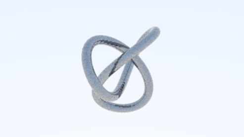
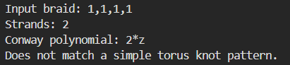

# Introduction
Knots are actually really cool!!! If you had a string, and scrambled it up a bit then tied the ends, the chances are that it can be transformed into a very cool equation. This is called the "Conway Polynomial". 

This repo is a combination of ray tracing (physics to get a really pretty image) + mathematical knots. 

We take an input of a "braid" representation of a knot (e.g. [1,1,1] for trefoil) and compute its Conway polynomial.

The way it works: a braid word turns into a product of Burau matrices, whose entries are polynomials in `t`. Taking `det(M - I)` and dividing by `1 + t + ... + t^(n-1)` gives the Alexander polynomial, which then gets rewritten in `z` to become the Conway polynomial. That rewrite happens in `s = t^(1/2)`, where `z = s - 1/s` and every power of `s` collapses through `s^2 = z*s + 1`.

Any number of strands works, and the closure doesn't have to be a knot — links come out too. A braid closing to several loops just means the polynomial lands on odd powers of `z` instead of even ones, and a link that falls apart into separate pieces gives `0`, which is the right answer rather than a failure. The number of loops is easy to work out yourself: ignore which strand goes over and which goes under, and just follow where each strand ends up.

Some things you can check by hand, which the tests do:

| Braid | Closes to | Conway polynomial |
|-------|-----------|-------------------|
| `1,1,1` | trefoil | `z^2 + 1` |
| `1,2,1,2` | trefoil again, on 3 strands | `z^2 + 1` |
| `1,-2,1,-2` | figure-eight knot | `-z^2 + 1` |
| `1,2,1` | Hopf link | `z` |
| `1,1,2,2` | two Hopf links joined | `z^2` |
| `1,-2,1,-2,1,-2` | Borromean rings | `z^4` |

Fair warning about braid words: what a word *looks* like and what it *closes to* are different things. `[1,2,1]` has the same shape as a trefoil word, but it actually closes into a Hopf link — so you get `z` back, and no render. Meanwhile `[1,2,1,2]` is a genuine trefoil written on 3 strands, and that one does render. The renderer decides by computing the polynomial, not by eyeballing the word, so it won't draw you a trefoil that isn't one. 

Unfortunately there is an incredibly large amount of type of knots in this world, so not all of them will be rendered. So the program checks if the knot you gave it is renderable per current standards, and renders it if it is. 

Warning: rendering a knot may take a VERY long time. This is because calculating the ppm just takes a long time, especially if we want to make it look cool. 
Calculating the conway polynomial though, won't take that long. Can refer a prototype image below to what it is supposed to look like. 
This project is still in the works to support more types of knots and improve user experience. 

## Braid Notation

Braids are represented as a list of signed integers corresponding to the generators of the Artin braid group.

- A positive integer `k` represents the generator $\sigma_k$.
- A negative integer `-k` represents the inverse generator $\sigma_k^{-1}$.

For example:

| Braid word | Vector representation |
|------------|-----------------------|
| $\sigma_1$ | `[1]` |
| $\sigma_1^{-1}$ | `[-1]` |
| $\sigma_2$ | `[2]` |
| $\sigma_2^{-1}$ | `[-2]` |
| $\sigma_1\sigma_2^{-1}\sigma_1$ | `[1, -2, 1]` |
| $(\sigma_1\sigma_2)^3$ | `[1, 2, 1, 2, 1, 2]` |

For more information, you can read this: https://en.wikipedia.org/wiki/Braid_group

# Raw Compilation 
cmake --build build  
./build/Debug/RayChasing.exe 1,1,1 > image.ppm  

Only the image goes to stdout, so redirecting gives you a clean `.ppm`. The braid info and the progress counter go to stderr, where they won't end up inside the image file.

**Careful with PowerShell.** Its `>` is not a plain byte redirect — it writes the text through an encoder and sticks a BOM on the front, which leaves you with a `.ppm` that no image viewer will open. (That is what happened to the `image.ppm` checked in here: it came out UTF-16.) From PowerShell, go through cmd instead:

    cmd /c ".\build\Debug\RayChasing.exe 1,1,1 > image.ppm"

Git Bash and cmd redirect raw bytes, so `>` is fine there. Once the file is written correctly, normal image tools open it directly.

# KNOT PROTOTYPE

